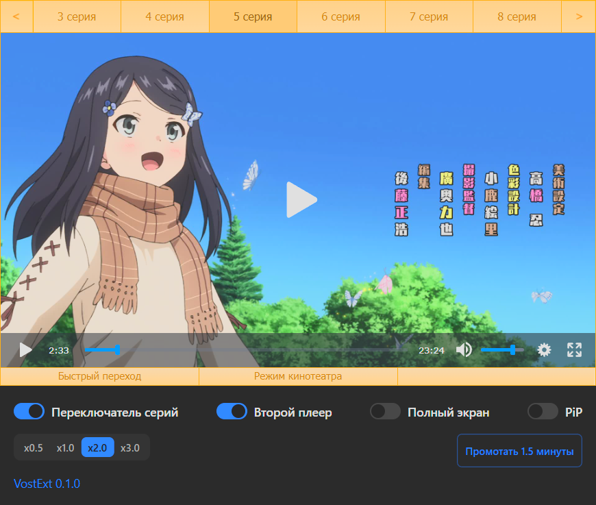

# VostExt - улучшение плеера animevost

- Автоматическое переключение серий
- Авто выбор второго плеера
- Автоматический переход в полноэкранный режим
- \* Автоматическое включение Pip

## Рекомендуемые инструменты

- [VS Code](https://code.visualstudio.com/) + [Volar](https://marketplace.visualstudio.com/items?itemName=Vue.volar).

## Картинка в картинке
### Chrome:
- для корректной работы PiP в настройках конфиденциальности нужно разрешить автоматическую картинку в картинке. После включение серии нужно кликнуть в любом месте страницы чтобы включился режим PiP

### Firefox:
- авто картинка-в-картинке работает через хак с новой вкладкой, для работы нужно включить `media.videocontrols.picture-in-picture.enable-when-switching-tabs.enabled` в `about:config`